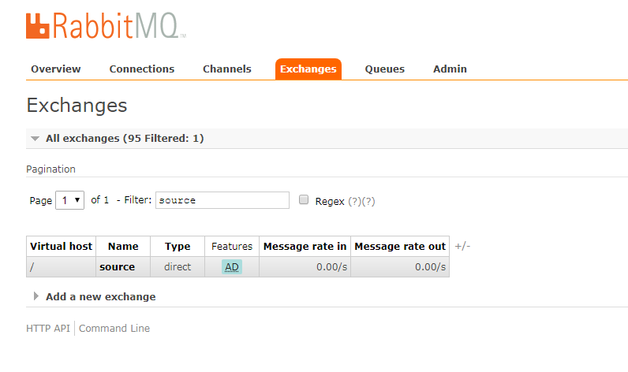
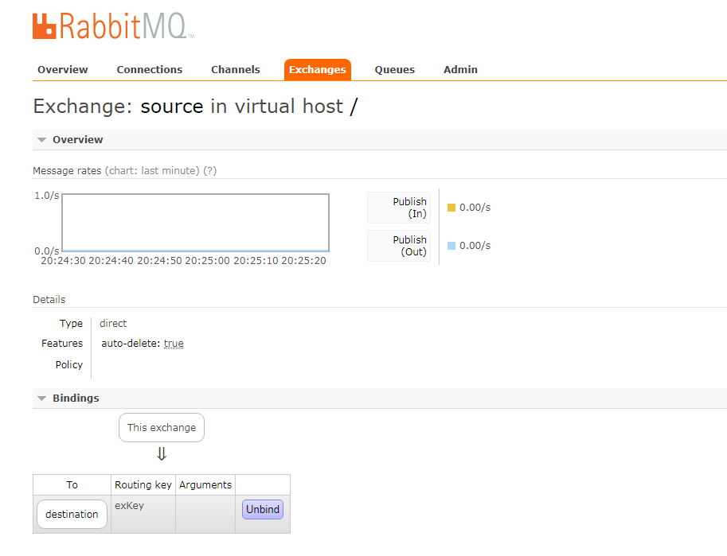

### 先奉上代码, 之后就是所示图画

<br/>

```java
package com.seliencepuppet.test;

import java.io.IOException;
import java.util.concurrent.TimeoutException;

import com.rabbitmq.client.Channel;
import com.rabbitmq.client.Connection;
import com.rabbitmq.client.ConnectionFactory;

public class Test06 {
    private static final String IP_ADDRESS = "192.168.1.1";
    private static final String VHOST = "/";
    private static final String USERNAME = "guest";
    private static final String PASSWORD = "guest";
    private static final int PORT = 5672;
	
    public static void main(String[] args) throws IOException, TimeoutException, InterruptedException {
	ConnectionFactory factory = new ConnectionFactory();
	factory.setHost(IP_ADDRESS);
	factory.setPort(PORT);
	factory.setUsername(USERNAME);
	factory.setPassword(PASSWORD);
	factory.setVirtualHost(VHOST);
		
	Connection connection = factory.newConnection();
	Channel channel = connection.createChannel();		
	channel.exchangeDeclare("source", "direct", false, true, null);
	channel.exchangeDeclare("destination", "fanout", false, true, null);
	channel.exchangeBind("destination", "source", "exKey");
	channel.queueDeclare("queue", false, false, true, null);
	channel.queueBind("queue", "destination", "");
	channel.basicPublish("source", "exKey", null, "exToExDemo".getBytes());
	channel.close();
	connection.close();
    }
}

```



交换机source将会与交换机destination关联


